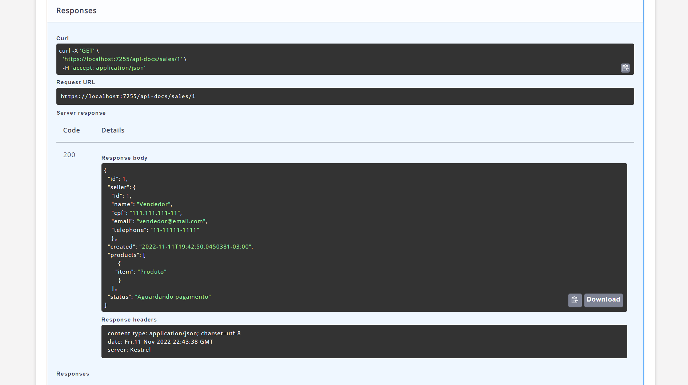
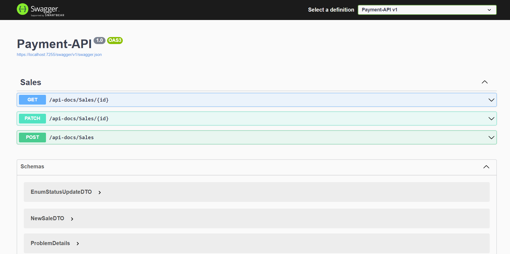

# Desafio Dio - Tech Pottencial: Payment API


**Projeto Web API ASP.NET para o desafio final do Bootcamp Pottencial .NET Developer**

### **Programas utilizados:**

- Visual Studio 2023
- .NET 6
- Entity Framework Core
- SQL Server


### **Códigos:**

#### **Startup.cs:**

csharp

```csharp
public class Startup
{
    public Startup(IConfiguration configuration)
    {
        Configuration = configuration;
    }

    public IConfiguration Configuration { get; }

    public void ConfigureServices(IServiceCollection services)
    {
        services.AddDbContext<DataContext>(options =>
            options.UseSqlServer(Configuration.GetConnectionString("DefaultConnection")));

        services.AddControllers();

        services.AddSwaggerGen(c =>
        {
            c.SwaggerDoc("v1", new OpenApiInfo { Title = "Payment API", Version = "v1" });
        });
    }

    public void Configure(IApplicationBuilder app, IWebHostEnvironment env)
    {
        if (env.IsDevelopment())
        {
            app.UseDeveloperExceptionPage();
            app.UseSwagger();
            app.UseSwaggerUI(c => c.SwaggerEndpoint("/swagger/v1/swagger.json", "Payment API v1"));
        }

        app.UseHttpsRedirection();

        app.UseRouting();

        app.UseAuthorization();

        app.UseEndpoints(endpoints =>
        {
            endpoints.MapControllers();
        });
    }
}
```


#### **DataContext.cs:**

csharp

```csharp
public class DataContext : DbContext
{
    public DataContext(DbContextOptions<DataContext> options) : base(options)
    {
    }

    public DbSet<Payment> Payments { get; set; }
}
```


#### **Payment.cs:**

csharp

```csharp
public class Payment
{
    public int Id { get; set; }

    public string Name { get; set; }

    public string Email { get; set; }

    public decimal Amount { get; set; }

    public string CardNumber { get; set; }

    public string Cvv { get; set; }

    public DateTime ExpirationDate { get; set; }
}
```


#### **PaymentsController.cs:**

csharp

```csharp
[Route("api/[controller]")]
[ApiController]
public class PaymentsController : ControllerBase
{
    private readonly DataContext _context;

    public PaymentsController(DataContext context)
    {
        _context = context;
    }

    [HttpGet]
    public async Task<ActionResult<IEnumerable<Payment>>> GetPayments()
    {
        return await _context.Payments.ToListAsync();
    }

    [HttpPost]
    public async Task<ActionResult<Payment>> PostPayment(Payment payment)
    {
        _context.Payments.Add(payment);
        await _context.SaveChangesAsync();

        return CreatedAtAction("GetPayment", new { id = payment.Id }, payment);
    }
}
```


**Swagger UI:**

Este projeto é um exemplo de uma API de pagamento simples desenvolvida com ASP.NET Core. 


Projeto final do **Bootcamp Pottencial .NET Developer** realizado na plataforma da DIO em parceria com a Pottencial Seguradora.

## Payment API

O Projeto consiste em uma Web API construída com ASP.NET Core 6 que realiza as seguintes operações:
- Registrar uma venda
- Buscar uma venda pelo ID
- Atualizar o status de uma venda



*Exemplo de um retorno do método GET*

###  Tecnologias:
------------------

- .NET 6
- Entity Framework Core 6
- Banco de dados em memória do EF Core 6
- AutoMapper
- Swagger

*Testes unitários*
- xUnit

- Moq

  

### Construção e Organização da API:

------------------

- `Models` possui as entidades:
    - `Sale` - Venda
    
    - `Seller` - Vendedor
    
    - `Product` - Produto
    
    - `EnumStatus` - para os status de venda utilizei o tipo `enum`.
    
    - Interfaces das classes de repositório e serviço.
    
      
    
- `DTOs` são as classes entidades apenas com as informações necessárias para cada método de ação da classe `Controller`. 

    

- Usei `Data Annotation` para validar as propriedades das classes nos diretórios `Models` e `DTOs`.


Separei a lógica de persistência das regras de negócios por meio das classes `Repository` e `Service`:


- `Persistence` possui as classes que gerenciam o banco de dados:
    - `PaymentContext` - para criação do banco de dados e tabelas.
    
    - `BaseRepository` - classe abstrata que recebe uma instância protegida da classe contexto através de injeção de dependência.
    
    - `SaleRepository` - classe que lida com o acesso aos dados.
    
    - `UnitOfWork` - classe com o método `SaveChanges()` para ter certeza que as alterações só serão salvas ao fim das modificações na classe de serviço.
    
      
    
- `Services`
    - `SaleServices` - lida com as regras de negócios.
    
      
    
- `Mapping` - possui as classes que fazem o mapeamento entre as classes `Models` e `DTOs`, e as configurações necessárias para as propriedades.

    

- `Controllers`
    
    - `SalesController` - recebe uma instância de implementação de `ISaleService` e `IMapper`.
    
      
    
- `Extensions`
    - `EnumExtensions` - classe estática que possui um método, que usa a informação no `data annotation` do enum para apresentar os dados.
    - `EnumUpdate` - classe com um método para validar a atualização do status.
    
    

> Testes unitários:
>
> Classe de serviço - `SaleService`  
> Classes de mapeamento - `ModelToDtoProfile` e `DtoToModelProfile`  
> Classe Controller - `SaleController`  


###  Swagger UI

------------------
- Para deixar a documentação swagger mais informativa adicionei comentários xml aos métodos de ação na classe Controller. 

- Usei CSS para alterar a estilização do swagger para a API ficar mais semelhante a identidade visual da Pottencial, usei como base o próprio site da [Pottencial](https://pottencial.com.br/).

Para fazer um comparativo adicionei as imagens do antes e depois:

- Imagem da interface padrão do swagger: 




- Imagem com a interface da API customizada e com mais informações:


Este projeto está licenciado nos termos da licença MIT.

